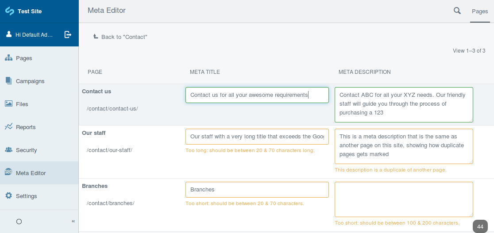

# SilverStripe Meta Editor

The SilverStripe Meta Editor interface allows easy editing of page Titles and Meta Descriptions
for pages within a ModelAdmin interface.

Values are updated directly via Ajax, providing handy warnings about value length and duplicates.

This module is a complete rebuild of [axllent/silverstripe-seo-editor](https://github.com/axllent/silverstripe-seo-editor)
for **SilverStripe 4**.




## Features

- Tree-like navigation, browse down into sub-pages
- Ajax updates, character counter
- Input validation (too long or short, duplicates)
- Data cleaning - excess whitepace removed
- Search, including selecting all pages with warnings
- Set non-editable pages (eg: RedirectPage)
- Set hidden pages (eg: ErrorPage)


## Requirements

- SilverStripe ^4


## Configuration

Please refer to the [Configuration docs](docs/en/Configuration.md).


## Installation

```
composer require axllent/silverstripe-meta-editor
```
